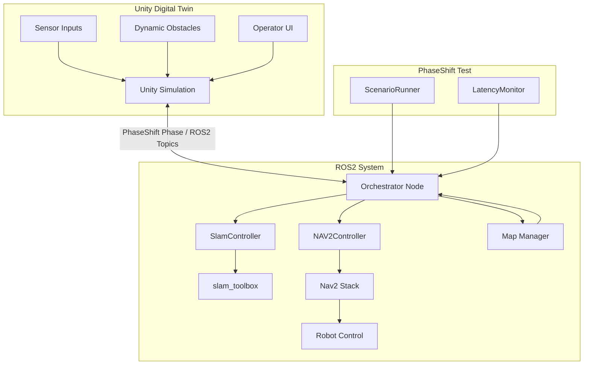

# PhaseShift-Digital-Twin

**PhaseShift-Digital-Twin** is a robotics simulation and automated testing framework built with **ROS2 and Unity**. 

## Overview

PhaseShift-Digital-Twin is a ROS2-integrated digital twin and simulation-based validation framework designed for robotics development and testing. The project combines Unity-based real-time visualization with a ROS2-native robotics stack, where autonomy, navigation, and system lifecycle management remain fully controlled by ROS2.

Rather than treating Unity as the primary simulation logic layer, this project adopts a ROS2-centric architecture in which Unity functions as a thin digital twin client for visualization, operator interaction, and test scenario generation. This separation enables clearer system boundaries between robot autonomy and simulation interfaces, making the platform easier to validate, extend, and maintain.

Built on top of slam_toolbox, Nav2, and a custom orchestrator node, the framework supports structured robot state management, navigation workflows, and repeatable scenario execution. In addition, it introduces an automated testing layer for validating robot behaviour in dynamic environments, including navigation scenario execution, obstacle injection, and latency monitoring across the perception-to-control pipeline.

The goal of this project is to provide a practical foundation for simulation-driven robotics testing, helping reduce hardware dependency during development while improving confidence in system behaviour before real-world deployment.

## System Architecture

The system architecture is organized around a ROS2-centric robotics stack with a dedicated testing layer and a Unity-based digital twin interface.

Within the ROS2 system, an Orchestrator Node manages the overall system lifecycle and coordinates high-level phases of operation. It interacts with specialized controllers such as the SLAM Controller and Nav2 Controller, which interface with the underlying slam_toolbox and Nav2 navigation stack. A Map Manager is responsible for handling mapping state and providing map data back to the orchestrator when required.

On top of the robotics stack, a lightweight testing layer introduces components such as ScenarioRunner and LatencyMonitor, enabling automated navigation scenarios and system performance measurements.

Unity operates as a digital twin client, providing real-time visualization of robot state, sensor data, and navigation behaviour. It also serves as an operator interface where users can interact with the system and introduce dynamic obstacles to create test scenarios during simulation.

## Testing Framework

A lightweight **robotics testing framework** was built on top of the navigation system to automate validation of robot behaviour.

The framework includes several components:

### ScenarioRunner
Executes waypoint-based navigation missions automatically and communicates with the system through the orchestrator goal service.

### LatencyMonitor
LatencyMonitor measures the end-to-end delay across the robot navigation pipeline, tracking how long it takes for sensor perception to propagate through planning and control layers before resulting in a robot actuation command.

/scan — primary perception input generated from a Velodyne VLP-16 LiDAR, converted to a 2D LaserScan stream for the navigation stack (sensor_msgs/LaserScan). In simulation, a custom LaserScan sensor model is used to reproduce equivalent perception data for testing and validation.

Pipeline measured:
Velodyne VLP-16 → LaserScan projection → Nav2 Costmap → Planner → Control
<!-- 
### Dynamic Obstacle Scenarios
Obstacles can be introduced during navigation to validate avoidance behaviour and system robustness.

This framework allows repeatable **simulation-based validation**, helping verify robot behaviour before deploying software to real hardware. -->

## Key Features

- ROS2-based **digital twin architecture**
- Integration of **SLAM (slam_toolbox) and Nav2 navigation**
- Custom **Orchestrator Node** for lifecycle and system state management
- Automated **scenario-based navigation testing**
- **Dynamic obstacle testing** in simulation
- **Sensor-to-control latency monitoring**
- Clear separation between **robot autonomy (ROS2)** and **visualization (Unity)**