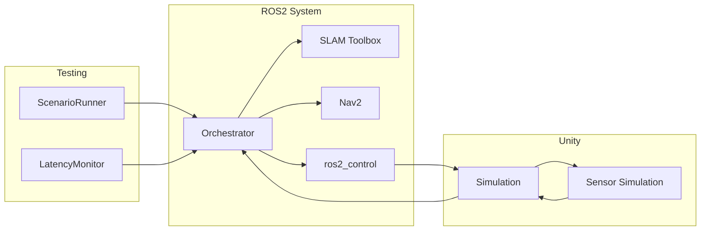
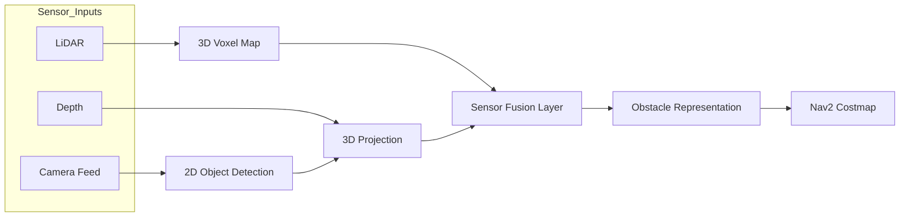

# PhaseShift-Digital-Twin

  <b>ROS2 + Unity Perception-driven Robotics Simulation & Automation Framework</b> 
  <i>Testable • Scalable • System-level Digital Twin</i>

  

  
  
  
  
  

# PhaseShift-Digital-Twin

ROS2 and Unity-based robotics simulation and automation framework for building testable Digital Twin systems.

## 1. Introduction

### 1.1 Overview

PhaseShift-Digital-Twin is designed to address a common limitation in robotics simulation:  
simulation environments are often tightly coupled, difficult to reuse, and not suitable for systematic validation.

This project provides a structured framework where:

- ROS2 handles system logic (SLAM, navigation, control)
- Unity provides simulation, visualization, and sensor generation
- Testing and validation are treated as first-class components

The focus is not only on simulation, but on enabling **repeatable and scalable validation of robotics systems**.

---

### 1.2 System Architecture

ROS2 acts as the system authority, while Unity operates as a digital twin interface.
This separation ensures reproducibility and allows the system to align with real-world robotics workflows.

### 1.3 Perception Layer

This pipeline fuses LiDAR-based voxel mapping with camera-based object detection,
ensuring that only validated 3D perception is injected into the navigation costmap.

## 2. Project

### Problem
In typical Digital Twin setups:

Simulation pipelines are rebuilt per scenario
Sensor configurations are not reusable
Validation is largely manual
Approach

This project introduces a reusable framework that enables:

Switching between SLAM and Navigation modes
Automated scenario execution
Dynamic obstacle injection during runtime
End-to-end latency measurement across the navigation pipeline
Workflow
SLAM → Map Generation → Navigation → Scenario Execution → Obstacle Injection → Latency Measurement
Outcome
Repeatable simulation-based validation
No dependency on physical hardware
Consistent testing of navigation and perception pipelines

## 3. Key Technologies

### Robotics System
- **ROS2** — system orchestration and communication backbone  
- **Nav2** — autonomous navigation (planning, control, costmaps)  
- **slam_toolbox** — LiDAR-based mapping and localization  

### Simulation & Digital Twin
- **Unity (URP)** — real-time simulation and visualization  
- **GPU-based sensor simulation** — LiDAR, camera, and depth pipelines for scalable testing  

### Perception Pipeline
- **YOLO** — real-time 2D object detection from simulated camera feeds  
- **Depth-based 3D projection** — lifting detections into spatial representations  
- **Voxel mapping (LiDAR SLAM)** — global 3D context for spatial reasoning  

### Automation & Validation
- **ScenarioRunner** — automated navigation and scenario execution  
- **LatencyMonitor** — end-to-end sensor-to-control latency measurement  

## 4. Validation Strategy

Beyond simulation-only validation, this framework was designed with a sim-to-real testing approach in mind.

### Sensor & Actuator Mocking
Simulation outputs (LiDAR, camera, depth) were used to mock real sensor inputs, enabling early-stage validation of perception and navigation pipelines without requiring physical hardware.

This allowed:
- Testing control logic under controlled, repeatable conditions
- Injecting edge cases that are difficult to reproduce in real environments
- Decoupling software development from hardware availability

### Sim-to-Real Perception Validation
Perception nodes developed and validated in simulation were later tested against real camera inputs.

This ensured:
- Consistency between simulated and real-world perception outputs
- Verification of object detection and spatial reasoning pipelines
- Identification of sim-to-real gaps in sensor characteristics and noise

### Outcome
- Reduced reliance on physical robots during development
- Improved confidence before real-world deployment
- Established a workflow bridging simulation-based testing and real-world validation
