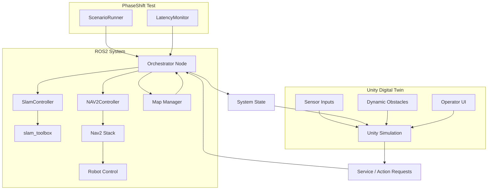

# PhaseShift-Digital-Twin

**PhaseShift-Digital-Twin** is a robotics simulation and automated testing framework built with **ROS2 and Unity**. 

## Why This Project Exists

When building Digital Twin systems with Unity and ROS2, one recurring problem quickly became obvious. Every time a new sensor or scenario was introduced, I had to manually rebuild simulation setups, reconnect ROS topics, and revalidate the entire pipeline.

This repetitive workflow significantly slowed down iteration, especially when testing SLAM and navigation behaviors. Instead of rebuilding environments from scratch, I designed a reusable simulation framework in Unity that allows:

* Rapid switching between SLAM and Navigation modes
* Consistent validation of ROS2 pipelines
* Reusable sensor simulation without reconfiguration

The goal is not just visualization, but to create a structured, testable Digital Twin environment where robotics logic (ROS2) and simulation (Unity) are clearly separated.
This makes the system scalable, reproducible, and suitable for real-world robotics development workflows.

## Overview

PhaseShift-Digital-Twin is a ROS2-centric Digital Twin system integrated with Unity.

* ROS2 acts as the system authority, handling SLAM, Navigation (Nav2), and orchestration.
Unity provides real-time visualization, operator interaction, and sensor simulation.

* The system supports two primary operational modes:

### SLAM Phase
Build maps interactively within Unity
Store waypoints during exploration
Generate and save occupancy maps

### Navigation Phase
Navigate to manually selected goals
Execute waypoint-based autonomous missions
Visualize planning, costmaps, and robot state in real time

To support these workflows, the project includes GPU-optimized sensor simulation pipelines in Unity, enabling efficient generation of:

* Depth data
* Point clouds
* Camera-based perception inputs

This allows rapid testing of robotics behaviors without requiring physical hardware.

## Dynamic Obstacle Avoidance (YOLO + Depth)

This project integrates a perception-driven navigation pipeline using GPU-accelerated sensor simulation, YOLO detection, and Nav2 costmap integration.

### YOLO Detection Node
* Unity generates compressed render textures using GPU acceleration for efficient sensor simulation
* The YOLO node decodes and processes these images using OpenCV (cv2.imdecode)
* Produces real-time 2D detections from simulated camera input

### Projection Node
* Lifts 2D detections into 3D space using depth data
* Maintains a consistent global representation (map frame)
* Acts as the bridge between perception and spatial reasoning

### Detection Navigation Adapter
* Transforms global detections into robot-relative coordinates
* Converts objects into point cloud obstacles
* Publishes directly to Nav2 costmaps for real-time avoidance

### Result
* Dynamic obstacles are detected, projected, and injected into the navigation stack
* Enables fully simulated, perception-driven obstacle avoidance without physical sensors

## System Architecture

The system architecture is organized around a ROS2-centric robotics stack with a dedicated testing layer and a Unity-based digital twin interface.

Within the ROS2 system, an Orchestrator Node manages the overall system lifecycle and coordinates high-level phases of operation. It interacts with specialized controllers such as the SLAM Controller and Nav2 Controller, which interface with the underlying slam_toolbox and Nav2 navigation stack. A Map Manager is responsible for handling mapping state and providing map data back to the orchestrator when required.

On top of the robotics stack, a lightweight testing layer introduces components such as ScenarioRunner and LatencyMonitor, enabling automated navigation scenarios and system performance measurements.

Unity operates as a digital twin client, providing real-time visualization of robot state, sensor data, and navigation behaviour. It also serves as an operator interface where users can interact with the system and introduce dynamic obstacles to create test scenarios during simulation.

## Testing Framework

A lightweight **robotics testing framework** was built on top of the navigation system to automate validation of robot behaviour.

The framework includes several components:

### ScenarioRunner
Executes waypoint-based navigation missions automatically and communicates with the system through the orchestrator goal service.

### LatencyMonitor
LatencyMonitor measures the end-to-end delay across the robot navigation pipeline, tracking how long it takes for sensor perception to propagate through planning and control layers before resulting in a robot actuation command.

/scan — primary perception input generated from a Velodyne VLP-16 LiDAR, converted to a 2D LaserScan stream for the navigation stack (sensor_msgs/LaserScan). In simulation, a custom LaserScan sensor model is used to reproduce equivalent perception data for testing and validation.

Pipeline measured:
Velodyne VLP-16 → LaserScan projection → Nav2 Costmap → Planner → Control
<!-- 
### Dynamic Obstacle Scenarios
Obstacles can be introduced during navigation to validate avoidance behaviour and system robustness.

This framework allows repeatable **simulation-based validation**, helping verify robot behaviour before deploying software to real hardware. -->

## Key Features

- ROS2-based **digital twin architecture**
- Integration of **SLAM (slam_toolbox) and Nav2 navigation**
- Custom **Orchestrator Node** for lifecycle and system state management
- Automated **scenario-based navigation testing**
- **Dynamic obstacle testing** in simulation
- **Sensor-to-control latency monitoring**
- Clear separation between **robot autonomy (ROS2)** and **visualization (Unity)**