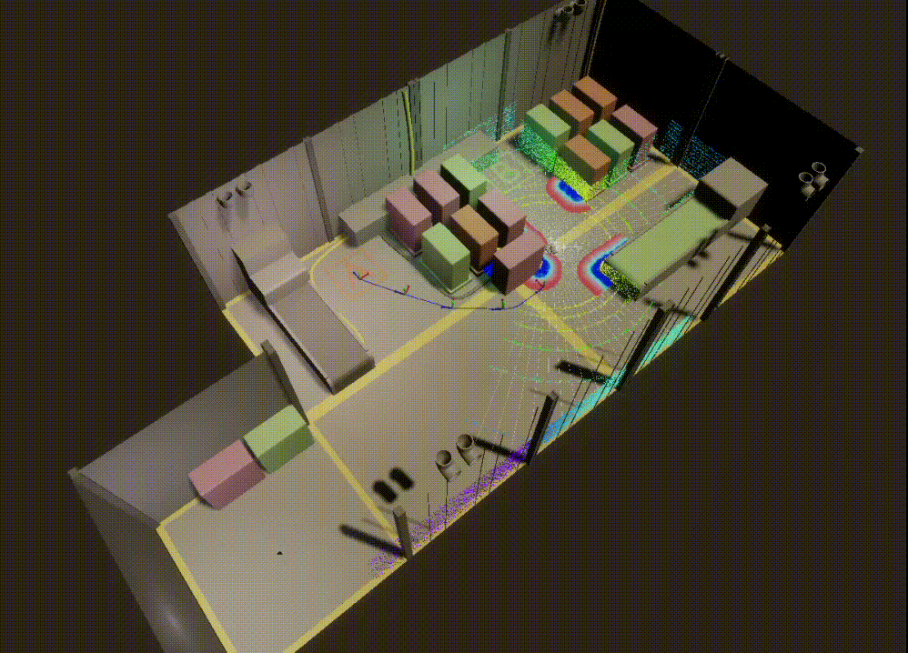

# PhaseShift-Digital-Twin

**PhaseShift-Digital-Twin** is a robotics simulation and automated testing framework built with **ROS2 and Unity**. 

## System Architecture

The system follows a **ROS2-centric architecture** where ROS2 acts as the source of truth for robot state, autonomy logic, and lifecycle management.

Unity is used purely as a **digital twin visualization and operator interface**, while all robotics decision logic remains inside ROS2.

ROS2 System
- Orchestrator Node  
  - System lifecycle management  
  - SLAM ↔ Navigation phase switching  
  - Unified `system_state` topic  

- SLAM  
  - slam_toolbox  

- Navigation  
  - Nav2 stack  

- Test Infrastructure  
  - ScenarioRunner  
  - LatencyMonitor  
  - Dynamic obstacle scenarios  

Unity Digital Twin

- Robot visualization  
- Sensor visualization  
- Operator interaction UI  

This architecture separates **robot autonomy logic and visualization**, making the system easier to test, maintain, and extend.

This project integrates **SLAM and Nav2 navigation** with a custom **orchestrator node** that manages system phases such as mapping, navigation readiness, and mission execution. The orchestrator exposes unified interfaces for external clients (Unity and test tools), allowing the robot to be controlled through structured services and system state topics.

On top of the navigation stack, an **automated testing layer** was implemented to support repeatable simulation-based validation. The testing framework executes navigation scenarios and evaluates robot behaviour under dynamic environments.

## ROS2 ↔ Unity Digital Twin

Unity is connected to ROS2 using **ros2-for-unity**, enabling real-time visualization of the robot system.

Unity acts as a **thin digital twin client**, subscribing to ROS2 topics such as:

- TF transforms
- Occupancy grid maps
- Navigation paths
- Sensor data (LiDAR / LaserScan)

The Unity environment mirrors the state of the ROS2 system rather than running independent logic.

The digital twin is also used to create **dynamic test environments**, allowing obstacles and scenarios to be introduced during navigation tests.

Key testing capabilities include:

- **Automated navigation scenarios** using waypoint-based missions  
- **Dynamic obstacle testing** to validate navigation robustness  
- **Sensor-to-control latency measurement** across the navigation pipeline  
- **Simulation-based validation** to test software behaviour before deploying to real hardware  

## Testing Framework

A lightweight **robotics testing framework** was built on top of the navigation system to automate validation of robot behaviour.

The framework includes several components:

### ScenarioRunner
Executes waypoint-based navigation missions automatically and communicates with the system through the orchestrator goal service.

### LatencyMonitor
Measures the delay between perception and robot actuation across the navigation pipeline.

Pipeline measured:

Sensor → Costmap → Planner → Control

### Dynamic Obstacle Scenarios
Obstacles can be introduced during navigation to validate avoidance behaviour and system robustness.

This framework allows repeatable **simulation-based validation**, helping verify robot behaviour before deploying software to real hardware.

## Key Features

- ROS2-based **digital twin architecture**
- Integration of **SLAM (slam_toolbox) and Nav2 navigation**
- Custom **Orchestrator Node** for lifecycle and system state management
- Automated **scenario-based navigation testing**
- **Dynamic obstacle testing** in simulation
- **Sensor-to-control latency monitoring**
- Clear separation between **robot autonomy (ROS2)** and **visualization (Unity)**